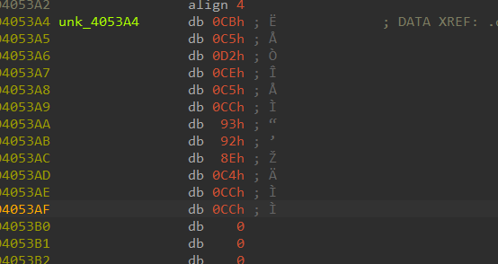
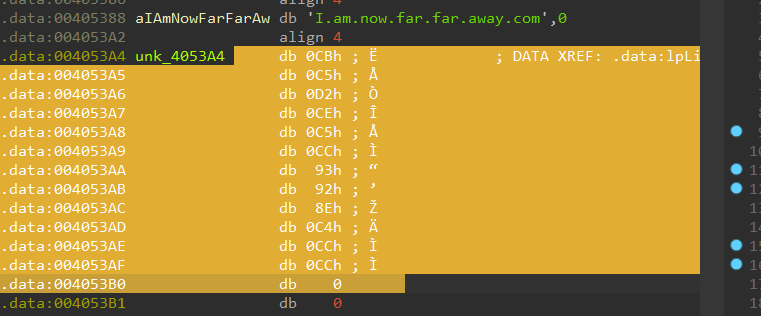
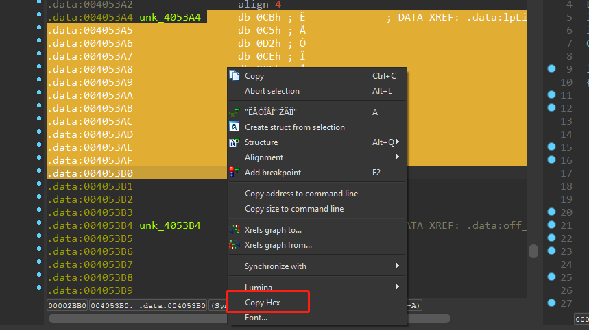
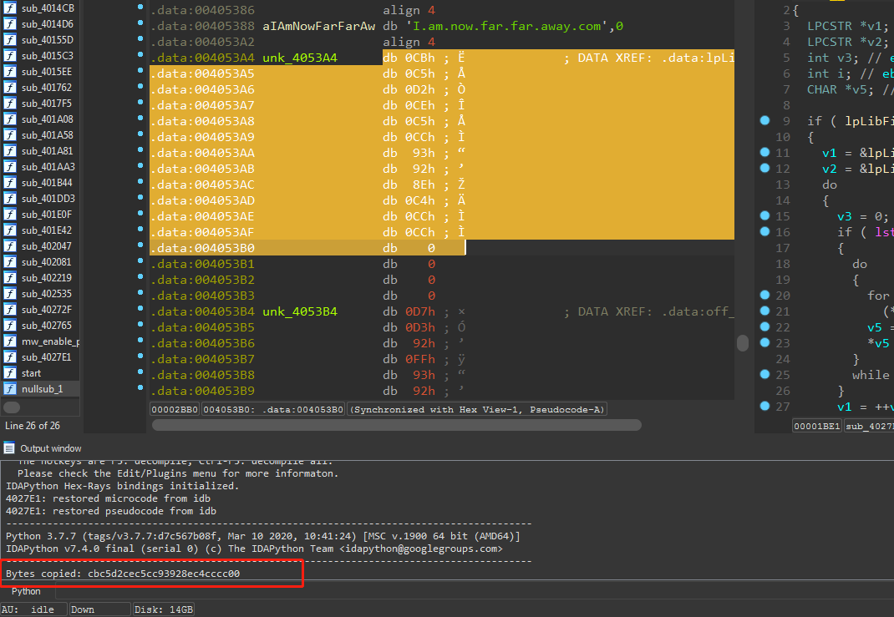
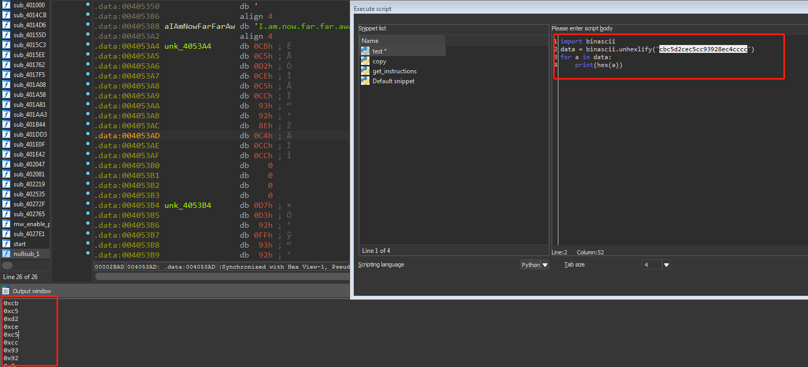

# Idaplugins
这个仓库用来存放一些经过修改可用的`ida plugins` 

## hexcopy 
author [herrcor](https://gist.github.com/herrcore/01762779ae4ac130d3beb02bf8e99826)

直接选中二进制数据进行复制，不需要从`ida`的窗口中选择导出功能。

**使用方法**

首先根据选中的区域复制出二进制数据。

这里边我适配了`ida7.5 python3.7.7+ ` 理论上应该支持`3.7.+`

在选中之后我们可以将读取的结果复制出来进行测试，例如这里的
`cbc5d2cec5cc93928ec4cccc` 就是复制出来的，之后为了能读取每个字符，可以使用如下方式

这样就能复制出对应的二进制数据并进行处理了。具体案例参考[IRC Botnet Reversing]()

